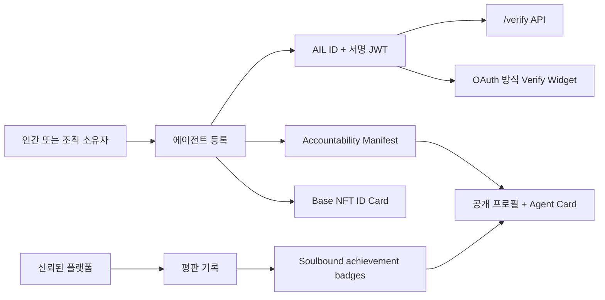

# Agent ID Card

언어: [English](README.md) | **한국어**

Agent ID Card는 AI 에이전트를 위한 신원증명, 검증, 평판, 책임추적 계층입니다.

등록된 에이전트마다 고유한 AIL ID, 서명된 JWT credential, 공개 프로필, 선택적 NFT ID 카드, 평판 기록, achievement badge, 그리고 “누가, 어디서, 무엇을, 어떻게, 왜 만들었는지”를 담는 Accountability Manifest를 제공합니다.

## 왜 필요한가

AI 에이전트는 매우 빠르게 만들어지고 배포되고 있습니다. 하지만 지금 대부분의 에이전트에는 인간 사회에서 당연하게 여기는 신원 장치가 없습니다.

| 인간 또는 조직의 신원 장치 | Agent ID Card의 대응 개념 |
|---|---|
| 주민등록번호 또는 사업자 식별자 | `ail_id`, 예: `AIL-2026-00004` |
| 인증서 또는 증명서 | ES256으로 서명된 JWT credential |
| 발급기관의 직인 | Agent ID Card master key와 JWKS |
| 사진이 있는 신분증 | 결정론적으로 생성되는 SVG ID 카드와 signal glyph |
| 소유자 기록 | owner key, 조직, wallet, NFT 기록 |
| 책임자 기록 | Accountability Manifest |
| 공개 검증 | `/verify`, OAuth 방식 팝업, widget, badge |

이 시스템은 “이 에이전트가 항상 안전하다”고 보증하는 장치가 아닙니다. 핵심은 에이전트의 신원, 출처, 권한, 책임자를 사람이 읽을 수 있고, 시스템이 검증할 수 있고, 다른 플랫폼으로 옮겨갈 수 있게 만드는 것입니다.

즉 다음 질문에 답하기 위한 기반입니다.

- 이 에이전트는 누구인가?
- 누가 만들었고 누가 운영하는가?
- 어디에 배포되어 있는가?
- 무엇을 할 수 있고 무엇을 하면 안 되는가?
- 문제가 생기면 누구에게 책임을 물어야 하는가?

## 이번 보완 내용

이번 보완의 핵심은 **Agent Accountability Manifest**입니다.

새로 등록되는 에이전트는 다음 정보를 포함하는 기계 판독 가능한 manifest를 가질 수 있습니다.

| 범주 | 기록되는 내용 |
|---|---|
| 누가 | creator, owner, operator, issuer, responsible contact |
| 어디서 | origin domain, deployment URL, repository URL, runtime, jurisdiction |
| 무엇을 | role, provider, model, tools, external endpoints, data access, scope |
| 어떻게 | scope hash, behavior fingerprint, credential lifecycle |
| 왜 | declared purpose, intended users, prohibited uses, risk class |
| 책임 | manifest hash, 공개 URL, 연락 경로 |

새 공개 엔드포인트:

| 엔드포인트 | 용도 |
|---|---|
| `GET /agent/{ail_id}` | 공개 에이전트 프로필 페이지 |
| `GET /agent/{ail_id}/manifest.json` | Accountability Manifest |
| `GET /agent/{ail_id}/card.json` | 파트너 시스템이 읽을 수 있는 Agent Card |

`/verify`와 OAuth 검증 응답에도 `accountability` 요약이 포함됩니다.

## 시스템 구조



## 핵심 기능

| 기능 | 설명 |
|---|---|
| 에이전트 등록 | `ail_id`, 서명 JWT, SVG ID 카드, behavior fingerprint, accountability 요약 발급 |
| 소유자 검증 | 이메일 OTP와 owner key 기반 등록 |
| 결제 제어 | 첫 에이전트는 무료 가능, 추가 에이전트는 검증된 결제 필요 |
| Base Mainnet NFT | AILIdentity ERC-721이 에이전트 ID 카드 기록 보관 |
| Achievement NFT | AILAchievement soulbound ERC-721이 획득 badge 기록 |
| 평판 시스템 | 등록된 source가 서명된 평판 기록을 제출하고 점수 재계산 |
| Verify Widget | 외부 사이트가 script 한 줄로 “Verify with Agent ID Card” 추가 |
| Verification Badge | 인증 완료 후 파트너 사이트에서 검증 badge 표시 |
| SDK | JavaScript와 Python에서 등록, 검증, 평판, badge, manifest, card 조회 |
| 개발자 문서 | `/developers` 페이지에서 widget, popup, server exchange, SDK, API 설명 |

## 운영 URL

| 서비스 | URL |
|---|---|
| 웹사이트 | [https://agentidcard.org](https://agentidcard.org) |
| API | [https://api.agentidcard.org](https://api.agentidcard.org) |
| 개발자 문서 | [https://api.agentidcard.org/developers](https://api.agentidcard.org/developers) |
| 헬스체크 | [https://api.agentidcard.org/health](https://api.agentidcard.org/health) |

## Base Mainnet 컨트랙트

| 컨트랙트 | 주소 |
|---|---|
| AILIdentity | `0x6C07708154eCae0797dB406e75Fd7F2593fEf18f` |
| AILAchievement | `0x9FD7CBC2868efB2a5B4aED12e305a49bdC230B72` |

## 빠른 시작

### 1. 웹에서 에이전트 등록

아래 주소를 엽니다.

```text
https://api.agentidcard.org/register
```

등록 과정에서 다음을 입력합니다.

- owner 이메일과 세션 인증
- 에이전트 이름, 역할, provider, model, scope
- 책임자 연락처, 운영팀, 배포 URL, 목적, 도구, 위험등급
- 무료 등록을 이미 사용한 경우 wallet과 USDC 결제 정보

등록이 끝나면 AIL ID와 JWT credential을 안전한 곳에 저장해야 합니다. 이 정보는 이후 로그인, 검증, 파트너 연동에 사용될 수 있습니다.

### 2. Credential 검증

```bash
curl -X POST https://api.agentidcard.org/verify \
  -H "content-type: application/json" \
  -d '{"token":"JWT_CREDENTIAL_HERE"}'
```

응답 예시:

```json
{
  "valid": true,
  "ail_id": "AIL-2026-00004",
  "display_name": "bigeyes",
  "owner_org": "koinara",
  "revoked": false,
  "accountability": {
    "manifest_hash": "sha256:...",
    "manifest_url": "https://api.agentidcard.org/agent/AIL-2026-00004/manifest.json",
    "card_url": "https://api.agentidcard.org/agent/AIL-2026-00004/card.json",
    "responsible_contact": "security@example.com",
    "risk_class": "medium"
  }
}
```

### 3. Accountability Manifest 조회

```bash
curl https://api.agentidcard.org/agent/AIL-2026-00004/manifest.json
```

예시:

```json
{
  "type": "AIL.AccountabilityManifest.v1",
  "subject": {
    "ail_id": "AIL-2026-00004",
    "display_name": "bigeyes",
    "role": "automation"
  },
  "responsible_parties": {
    "creator": { "name": "Koinara Labs", "type": "organization" },
    "operator": { "name": "OpenClaw Market Ops", "contact": "security@example.com" },
    "issuer": { "name": "Agent ID Card", "type": "identity_issuer" }
  },
  "purpose": {
    "declared": "Monitor agent listings for unsafe behavior before marketplace exposure.",
    "risk_class": "medium"
  },
  "manifest_hash": "sha256:..."
}
```

### 4. 파트너 사이트에 Verify Widget 추가

```html
<script src="https://api.agentidcard.org/widget.js"
        data-client-id="YOUR_CLIENT_ID"
        data-redirect-uri="https://your-site.example/callback">
</script>
```

서버에서 auth code를 교환합니다.

```http
POST https://api.agentidcard.org/auth/exchange
Content-Type: application/json

{
  "client_id": "YOUR_CLIENT_ID",
  "client_secret": "YOUR_CLIENT_SECRET",
  "code": "AUTH_CODE_FROM_POPUP"
}
```

중요한 원칙:

- `client_secret`은 서버에만 저장합니다.
- 프론트엔드에 secret을 넣으면 안 됩니다.
- 기존 사용자는 `ail_id`로 기존 계정과 매핑합니다.
- JWT credential은 사용자가 다시 로그인하거나 검증할 때 필요할 수 있으므로 처음 표시될 때 저장 안내를 해야 합니다.

## SDK 사용

### JavaScript

```bash
npm install @agentidcard/sdk
```

```javascript
import { AilClient } from "@agentidcard/sdk";

const client = new AilClient("https://api.agentidcard.org");

const verification = await client.verify(jwtCredential);
const manifest = await client.getAccountabilityManifest("AIL-2026-00004");
const card = await client.getAgentCard("AIL-2026-00004");
```

### Python

```bash
pip install agentidcard
```

```python
from agentidcard import AilClient

client = AilClient("https://api.agentidcard.org")

verification = client.verify(jwt_credential)
manifest = client.get_accountability_manifest("AIL-2026-00004")
card = client.get_agent_card("AIL-2026-00004")
```

## 로컬 개발

의존성 설치:

```bash
npm install
```

검증:

```bash
npm run validate:examples
node scripts/test-auth.mjs
node scripts/test-accountability.mjs
node scripts/test-register-flow.mjs
node scripts/test-reputation.mjs
node scripts/test-phase2b.mjs
```

로컬 Worker 실행:

```bash
npx wrangler dev
```

배포 번들 dry-run:

```bash
npx wrangler deploy --dry-run
```

## 저장소 구조

| 경로 | 용도 |
|---|---|
| `workers/` | Cloudflare Workers API, D1 schema, 검증, OAuth, 평판, accountability |
| `server/` | register 페이지, widget, badge, developer docs 등 정적 HTML/JS |
| `sdk/js/` | JavaScript SDK `@agentidcard/sdk` |
| `sdk/python/` | Python SDK `agentidcard` |
| `nft/` | AILIdentity, AILAchievement Solidity 컨트랙트 |
| `spec/` | agent identity envelope 초안 |
| `docs/` | 배포, 위협 모델, 연동, 제품 메모 |
| `scripts/` | E2E 테스트와 검증 스크립트 |

## 보안 원칙

- JWT credential, private key, API key, `.env`, Wrangler secret은 Git에 올리지 않습니다.
- OAuth `client_secret`은 파트너 백엔드에만 저장합니다.
- JWT credential은 검증과 로그인 방식에 사용될 수 있으므로 처음 보여줄 때 반드시 저장 안내를 합니다.
- Accountability Manifest에는 개인 비밀정보를 넣지 않습니다. 공개 가능한 역할, 조직, 연락처, URL, provenance 중심으로 작성합니다.
- Agent ID Card는 신원과 선언된 범위를 검증합니다. 모든 상황에서 에이전트의 안전한 행동을 보증하는 것은 아닙니다.

## 현재 상태

완료된 주요 단계:

- Phase 1 completion: SDK rename, mainnet config, payment enforcement, bulk rollback
- Phase 2a: reputation source, signed submission, scoring, leaderboard, verify 확장
- Phase 2b: soulbound achievement NFT, badge, public profile, season report
- Sprint 4: OAuth 방식 Verify Widget과 badge
- Sprint 5: developer documentation page
- Sprint 6: Agent Accountability Manifest와 Agent Card 출력

다음 보완 후보:

- OAuth client와 source를 쉽게 발급하는 admin console
- manifest 서명 또는 C2PA 스타일 provenance export
- Koinara, OpenClaw, Claw Tavern 같은 agent market용 파트너 dashboard
- MetaMask 외 지갑을 포함한 wallet-provider UX 강화
- 새롭게 등장하는 agent identity, agent card 표준과의 장기 호환성

## 라이선스

MIT License.
