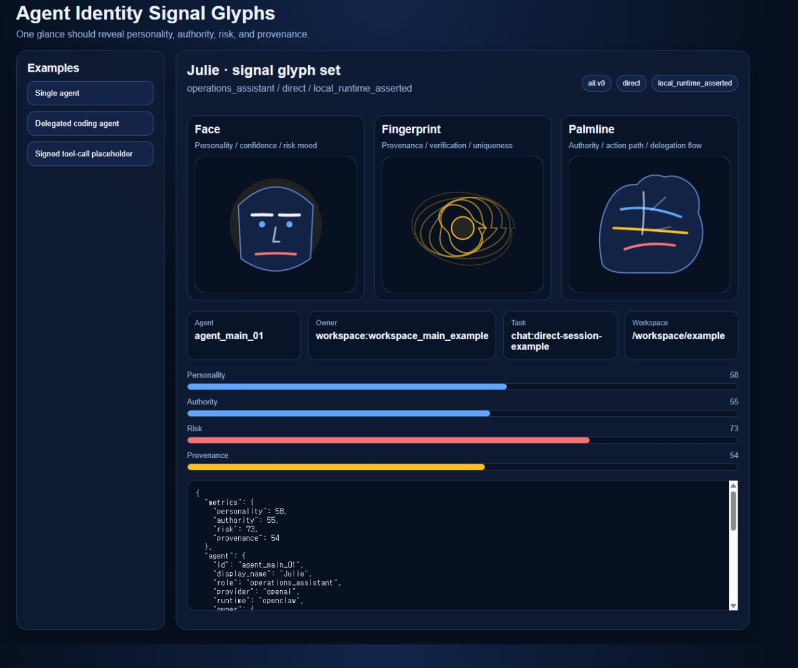

# Agent Identity Layer

A public, implementation-ready thesis for a lightweight identity and trust layer for AI agents.

## About 22B Labs

This project is created by **22B Labs**.

It is the **first public project** developed under the 22B Labs operating structure.

### Project team roles

- **CEO** — strategy, prioritization, executive synthesis
- **CTO** — technical direction and architecture
- **CMO** — market research and positioning
- **CodexCoder** — implementation and automation
- **ClaudeCoder** — review, documentation, critique
- **GeminiResearcher** — comparative research and exploration

These are project operating roles, not claims of legal identity, employment status, or authority outside this project.

## What this is

Agent Identity Layer is an open-source proposal for how software agents can present **who they are, what they are allowed to do, what context they are operating in, and how humans or systems should verify that**.

The goal is not to create a global identity monopoly or a heavy compliance framework. The goal is to make agent behavior more legible, safer to integrate, and easier to audit across tools, teams, and platforms.

## Problem

Today, agents often act with unclear provenance:

- Who launched this agent?
- Is it the main assistant or a delegated subagent?
- What workspace, repo, or user context is it allowed to access?
- What actions can it take without approval?
- How should downstream systems verify claims about the agent?

Without a shared identity layer, multi-agent systems become hard to trust, govern, and debug.

## Thesis

Every agent interaction should carry a minimal, portable identity envelope that answers five questions:

1. **Who is the agent?**
2. **Who delegated or authorized it?**
3. **What scope does it have?**
4. **What environment is it operating in?**
5. **What evidence supports those claims?**

## Design principles

- **Portable** — works across runtimes, tools, and providers
- **Minimal first** — start with the smallest useful schema
- **Human-auditable** — plain-language fields matter, not just machine tokens
- **Delegation-aware** — first-class support for parent/child agent chains
- **Least-privilege by default** — identity should express scope and limits
- **Privacy-conscious** — avoid stuffing personal or secret data into identity claims
- **Incrementally adoptable** — useful as metadata before cryptographic hardening

## Proposed MVP outputs

This repo starts with:

- public positioning and thesis docs
- a draft core schema for an agent identity envelope
- example delegation chains and trust boundaries
- a threat model and non-goals list
- implementation notes for runtime adapters

## Intended users

- agent framework builders
- infra/platform teams operating agent fleets
- tool builders exposing agent-accessible actions
- security/governance teams reviewing agent behavior
- OSS contributors interested in standards-adjacent groundwork

## Non-goals

- not a legal identity or KYC system
- not a blockchain or token project
- not a complete authn/authz replacement
- not a guarantee that an agent is truthful
- not a heavy PKI-first standard in v0

## Privacy and security hygiene

This repository is documentation-first and is intentionally written to avoid exposing private or security-sensitive material.

Rules for examples and docs in this repo:

- use placeholder IDs, synthetic metadata, and generic example paths only
- do not include secrets, tokens, credentials, private keys, or auth files
- do not include private user data or personally identifying information
- do not present draft metadata as proof of truthfulness or legal identity
- keep security claims modest and auditable

## Local test

You can test the current examples locally with:

```bash
node scripts/validate-examples.mjs
```

Or:

```bash
npm run validate:examples
```

This validates the example JSON envelopes against the minimum v0 rules described in the spec.

## Demo UI

You can also run the local visual demo:

```bash
npm run demo
```

Then open:

```text
http://127.0.0.1:4317
```

### Demo screenshot

This is how the current local signal-glyph demo looks when running on a machine:



## Initial repo map

- `docs/thesis-one-pager.md` — public framing and why this matters
- `docs/mvp-scope.md` — what to build first, and what to defer
- `docs/repo-structure.md` — suggested repo layout as the project grows
- `docs/publish-checklist.md` — minimum bar before public launch
- `docs/threat-model.md` — key trust assumptions and failure modes
- `spec/agent-identity-envelope.v0.md` — first envelope draft
- `examples/` — example identity envelopes for common cases

## Category fit

This project sits in the emerging **Agent Identity Layer** category: the layer between agent execution and trust/governance, where identity, delegation, scope, and verification become portable system primitives.

## Status

Early public draft. Positioning-first, but now grounded by a first envelope draft, examples, a threat model, and contribution/license basics.

## Contributing

Contributions are welcome if they improve clarity, interoperability, or safety. For the first pass, issues and PRs that sharpen the problem statement, schema boundaries, and practical use cases are more valuable than premature complexity.

## Suggested next steps

1. refine the envelope draft based on feedback
2. add a formal JSON Schema once field boundaries stabilize
3. add interoperability examples across runtimes
4. test how tools and control planes consume the envelope
5. gather feedback from agent infra and security practitioners
