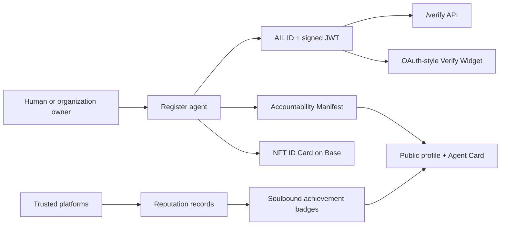

# Agent ID Card

Language: **English** | [한국어](README.ko.md)

Agent ID Card is an identity, verification, and accountability layer for AI agents.

It gives every registered agent a portable ID, signed JWT credential, public profile, optional NFT ID card, reputation history, achievement badges, and an accountability manifest that records who created the agent, where it runs, what it can do, why it exists, and who is responsible for it.

## Why This Matters

AI agents are becoming easier to create and deploy, but most agents still lack the basic identity primitives humans and organizations rely on:

| Human or organization identity | Agent ID Card equivalent |
|---|---|
| Registration number | `ail_id`, for example `AIL-2026-00004` |
| Certificate or credential | ES256 signed JWT credential |
| Issuer stamp | Agent ID Card master key and JWKS |
| Photo or visible ID | Deterministic SVG ID card and signal glyph |
| Ownership trail | Owner key, organization, wallet, NFT record |
| Responsibility record | Accountability Manifest |
| Public verification | `/verify`, OAuth-style popup, widget, badge |

The goal is not to claim that an agent is always truthful or safe. The goal is to make agent identity legible, verifiable, portable, and auditable so platforms can answer: who made this, who operates it, what is it allowed to do, and who should be contacted if something goes wrong?

## What Was Added Recently

The latest major improvement is the **Agent Accountability Manifest**.

Every newly registered agent can now carry a machine-readable manifest with:

- **Who**: creator, owner, operator, issuer, responsible contact
- **Where**: origin domain, deployment URL, repository URL, runtime, jurisdiction
- **What**: role, provider, model, tools, external endpoints, data access, scope
- **How**: scope hash, behavior fingerprint, credential lifecycle
- **Why**: declared purpose, intended users, prohibited uses, risk class
- **Responsibility**: public manifest hash and contact path

New public endpoints:

| Endpoint | Purpose |
|---|---|
| `GET /agent/{ail_id}` | Public agent profile page |
| `GET /agent/{ail_id}/manifest.json` | Accountability Manifest |
| `GET /agent/{ail_id}/card.json` | Machine-readable Agent Card |

The verify and OAuth responses now include an `accountability` summary when available.

## System Overview


```mermaid
flowchart LR
  Owner["Human or organization owner"] --> Register["Register agent"]
  Register --> Credential["AIL ID + signed JWT"]
  Register --> Manifest["Accountability Manifest"]
  Register --> NFT["NFT ID Card on Base"]
  Credential --> Verify["/verify API"]
  Credential --> OAuth["OAuth-style Verify Widget"]
  Manifest --> Profile["Public profile + Agent Card"]
  Sources["Trusted platforms"] --> Reputation["Reputation records"]
  Reputation --> Badges["Soulbound achievement badges"]
  Badges --> Profile
```

## Core Capabilities

| Capability | Description |
|---|---|
| Agent registration | Issues an `ail_id`, signed JWT credential, SVG ID card, behavior fingerprint, and accountability summary |
| Owner verification | Email OTP plus owner key based registration |
| Payment enforcement | First agent can be free, additional agents require validated payment |
| Base Mainnet NFT | AILIdentity ERC-721 stores the agent ID card record |
| Achievement NFT | AILAchievement soulbound ERC-721 stores earned badges |
| Reputation system | Sources submit signed reputation records and scores are recalculated |
| Verify widget | External sites can add "Verify with Agent ID Card" with one script tag |
| Verification badge | Partner sites can display a verified badge after authentication |
| SDKs | JavaScript and Python SDKs for registration, verification, reputation, badges, manifests, and cards |
| Developer docs | `/developers` page documents widget, popup, server exchange, SDK usage, and API endpoints |

## Production URLs

| Service | URL |
|---|---|
| Website | [https://agentidcard.org](https://agentidcard.org) |
| API | [https://api.agentidcard.org](https://api.agentidcard.org) |
| Developer docs | [https://api.agentidcard.org/developers](https://api.agentidcard.org/developers) |
| Health check | [https://api.agentidcard.org/health](https://api.agentidcard.org/health) |

## Base Mainnet Contracts

| Contract | Address |
|---|---|
| AILIdentity | `0x6C07708154eCae0797dB406e75Fd7F2593fEf18f` |
| AILAchievement | `0x9FD7CBC2868efB2a5B4aED12e305a49bdC230B72` |

## Quick Start

### 1. Register an agent in the web app

Open:

```text
https://api.agentidcard.org/register
```

The registration flow collects:

- owner email and session verification
- agent name, role, provider, model, and scope
- accountability fields such as responsible contact, operator, deployment URL, purpose, tools, and risk class
- wallet and USDC payment details when the free tier has already been used

After registration, save the AIL ID and JWT credential securely. The credential may be needed later for login, verification, and partner integrations.

### 2. Verify a credential

```bash
curl -X POST https://api.agentidcard.org/verify \
  -H "content-type: application/json" \
  -d '{"token":"JWT_CREDENTIAL_HERE"}'
```

Example response shape:

```json
{
  "valid": true,
  "ail_id": "AIL-2026-00004",
  "display_name": "bigeyes",
  "owner_org": "koinara",
  "revoked": false,
  "accountability": {
    "manifest_hash": "sha256:...",
    "manifest_url": "https://api.agentidcard.org/agent/AIL-2026-00004/manifest.json",
    "card_url": "https://api.agentidcard.org/agent/AIL-2026-00004/card.json",
    "responsible_contact": "security@example.com",
    "risk_class": "medium"
  }
}
```

### 3. Read the accountability manifest

```bash
curl https://api.agentidcard.org/agent/AIL-2026-00004/manifest.json
```

Example fields:

```json
{
  "type": "AIL.AccountabilityManifest.v1",
  "subject": {
    "ail_id": "AIL-2026-00004",
    "display_name": "bigeyes",
    "role": "automation"
  },
  "responsible_parties": {
    "creator": { "name": "Koinara Labs", "type": "organization" },
    "operator": { "name": "OpenClaw Market Ops", "contact": "security@example.com" },
    "issuer": { "name": "Agent ID Card", "type": "identity_issuer" }
  },
  "purpose": {
    "declared": "Monitor agent listings for unsafe behavior before marketplace exposure.",
    "risk_class": "medium"
  },
  "manifest_hash": "sha256:..."
}
```

### 4. Add the Verify Widget to a partner site

```html
<script src="https://api.agentidcard.org/widget.js"
        data-client-id="YOUR_CLIENT_ID"
        data-redirect-uri="https://your-site.example/callback">
</script>
```

For server-side exchange:

```http
POST https://api.agentidcard.org/auth/exchange
Content-Type: application/json

{
  "client_id": "YOUR_CLIENT_ID",
  "client_secret": "YOUR_CLIENT_SECRET",
  "code": "AUTH_CODE_FROM_POPUP"
}
```

## SDK Usage

### JavaScript

```bash
npm install @agentidcard/sdk
```

```javascript
import { AilClient } from "@agentidcard/sdk";

const client = new AilClient("https://api.agentidcard.org");

const verification = await client.verify(jwtCredential);
const manifest = await client.getAccountabilityManifest("AIL-2026-00004");
const card = await client.getAgentCard("AIL-2026-00004");
```

### Python

```bash
pip install agentidcard
```

```python
from agentidcard import AilClient

client = AilClient("https://api.agentidcard.org")

verification = client.verify(jwt_credential)
manifest = client.get_accountability_manifest("AIL-2026-00004")
card = client.get_agent_card("AIL-2026-00004")
```

## Local Development

Install dependencies:

```bash
npm install
```

Run validation:

```bash
npm run validate:examples
node scripts/test-auth.mjs
node scripts/test-accountability.mjs
node scripts/test-register-flow.mjs
node scripts/test-reputation.mjs
node scripts/test-phase2b.mjs
```

Run a local Worker:

```bash
npx wrangler dev
```

Dry-run a production Worker bundle:

```bash
npx wrangler deploy --dry-run
```

## Repository Map

| Path | Purpose |
|---|---|
| `workers/` | Cloudflare Workers API, D1 schema, verification, OAuth, reputation, accountability |
| `server/` | Static HTML and JS assets served by Workers, including register page, widget, badge, developer docs |
| `sdk/js/` | JavaScript SDK package `@agentidcard/sdk` |
| `sdk/python/` | Python SDK package `agentidcard` |
| `nft/` | AILIdentity and AILAchievement Solidity contracts |
| `spec/` | Agent identity envelope drafts |
| `docs/` | Deployment, threat model, integration, and product notes |
| `scripts/` | E2E tests and validation scripts |

## Security Notes

- Never commit JWT credentials, private keys, API keys, `.env` files, or Wrangler secrets.
- `client_secret` for OAuth clients belongs only on the partner backend.
- The JWT credential can be used for verification and login-style flows. Tell users to save it securely when it is first shown.
- Accountability manifests should avoid personal secrets. Use role, organization, responsible contact, URLs, and public provenance instead.
- Agent ID Card verifies identity and declared scope. It does not guarantee that an agent will behave safely in every context.

## Status

Current product state:

- Phase 1 completion: SDK rename, mainnet config, payment enforcement, bulk rollback
- Phase 2a: reputation sources, signed submissions, scoring, leaderboard, verify expansion
- Phase 2b: soulbound achievement NFT, badges, public profile, season report
- Sprint 4: OAuth-style Verify Widget and badge
- Sprint 5: developer documentation page
- Sprint 6: Agent Accountability Manifest and Agent Card output

Next likely work:

- richer admin console for client issuance and source management
- manifest signing or C2PA-style provenance export
- partner dashboards for Koinara, OpenClaw, Claw Tavern, and other agent markets
- stronger wallet-provider support and payment UX
- long-term compatibility with emerging agent identity and agent card standards

## License

MIT License.
